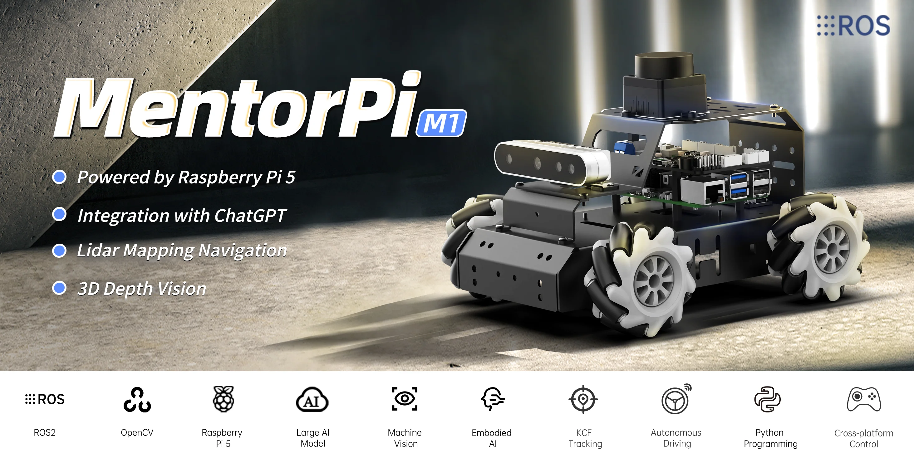
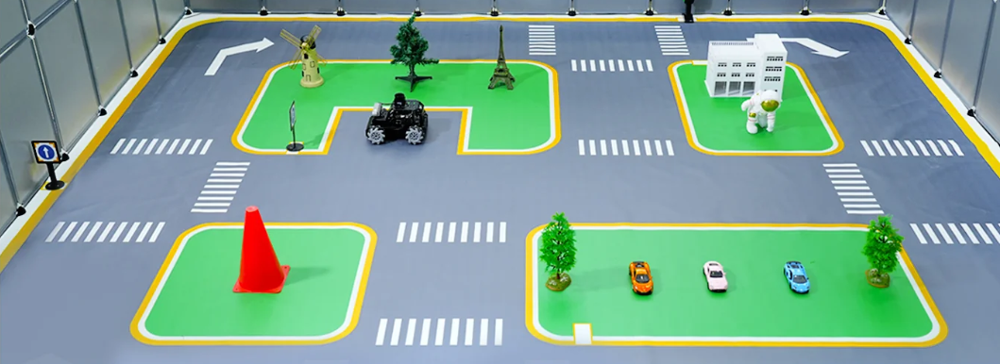

# MentorPi A1

English | [中文](https://github.com/Hiwonder/MentorPi/blob/MentorPi-A1/README_cn.md)

<p align="center">
  
</p>

## About MentorPi

We created MentorPi with a simple goal: to build an accessible, cost-effective educational robotics platform that integrates AI and ROS 2. By combining powerful large language models with a flexible hardware design, we hope to empower engineers, students, and creators to learn and experiment with AI robotics—and bring their most imaginative projects to life.

<p align="center">
  
</p>

### Built for Real AI and Real Learning

MentorPi is built around a robust STM32 + Raspberry Pi 5 control system and offers 3 chassis options: Ackermann chassis, Mecanum wheels and tank chassis, so you can pick the right setup for your application. Despite its compact size, it's packed with capable hardwares: high-speed encoder motors, LiDAR, a 3D depth camera, and an AI voice module. This lets you implement advanced AI behaviors like SLAM-based navigation, real-time object tracking, and traffic sign recognition using YOLOv11—all the way to fully autonomous driving.

<p align="center">
  
</p>

### Open, Expandable, and Evolving

As a fully open source platform, MentorPi is made for customization and expansion. This year, we've introduced multi-chassis support and integrated multimodal AI models with natural voice interaction—enabling more sophisticated embodied intelligence tasks. Whether you're building autonomous driving systems or exploring human robot interaction, we welcome you to join our community and help shape the future of MentorPi.

<p align="center">
  
</p>

Get started with our [MentorPi Tutorials](https://docs.hiwonder.com/projects/MentorPi/en/latest/) to bring your first robot to life.

## Official Resources

### Official Hiwonder
- **Official Website**: [https://www.hiwonder.net/](https://www.hiwonder.net/)
- **Product Page**: [https://www.hiwonder.com/products/mentorpi-a1](https://www.hiwonder.com/products/mentorpi-a1)
- **Official Documentation**: [https://docs.hiwonder.com/projects/MentorPi/en/latest/](https://docs.hiwonder.com/projects/MentorPi/en/latest/)
- **Technical Support**: support@hiwonder.com

## Key Features

### AI Vision & Navigation
- **SLAM Mapping** - Real-time simultaneous localization and mapping
- **Path Planning** - Intelligent route planning and navigation
- **Autonomous Driving** - Self-driving capabilities with obstacle avoidance
- **YOLOv5 Recognition** - Advanced object detection for road signs and traffic lights
- **3D Depth Perception** - Stereo vision with depth camera integration

### Intelligent Control
- **Closed-loop Motor Control** - High-precision encoder feedback control
- **Lidar Navigation** - 360-degree laser scanning for mapping and navigation
- **Servo Control** - High-torque servo systems for precise movements
- **Multi-sensor Fusion** - Integrated sensor data processing

### Programming Interface
- **ROS2 Integration** - Full Robot Operating System 2 support
- **Python Programming** - Comprehensive Python SDK
- **Multimodal AI Model** - Advanced embodied AI capabilities
- **Machine Learning** - YOLOv5 training and inference support

## Hardware Configuration
- **Processor**: Raspberry Pi 5
- **Operating System**: ROS2 compatible Linux
- **Motors**: High-speed closed-loop encoder motors
- **Vision System**: 3D depth camera + Lidar sensor
- **Actuators**: High-torque servos
- **Chassis**: Supports three chassis configurations: Mecanum wheels, Ackermann, and tank tracks

## Project Structure

```
mentorpi/
├── app/                    # Application modules
├── bringup/               # System startup and configuration
├── calibration/           # Sensor calibration utilities
├── driver/                # Hardware drivers
├── example/               # Example applications and demos
├── interfaces/            # ROS2 message definitions
├── large_models/          # AI large model integration
├── multi/                 # Multi-robot coordination
├── navigation/            # Navigation stack
├── peripherals/           # Peripheral device support
├── simulations/           # Simulation environments
├── slam/                  # SLAM algorithms
└── yolov5_ros2/          # YOLOv5 ROS2 integration
```

## Version Information
- **Current Version**: MentorPi A1 v1.0.0
- **Supported Platform**: Raspberry Pi 5

### Related Technologies
- [ROS2](https://ros.org/) - Robot Operating System 2
- [OpenCV](https://opencv.org/) - Computer Vision Library
- [YOLOv5](https://github.com/ultralytics/yolov5) - Object Detection Framework

---

**Note**: This program is pre-installed on the MentorPi A1 robot system and can be run directly. For detailed tutorials, please refer to the [Official Documentation](https://docs.hiwonder.com/projects/MentorPi/en/latest/).