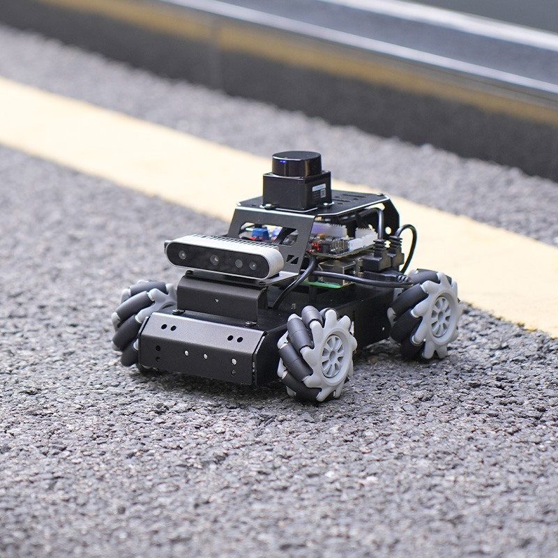
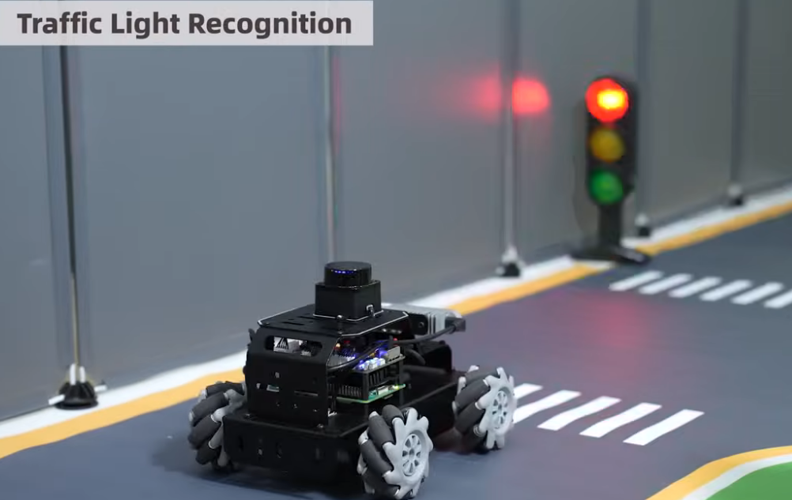
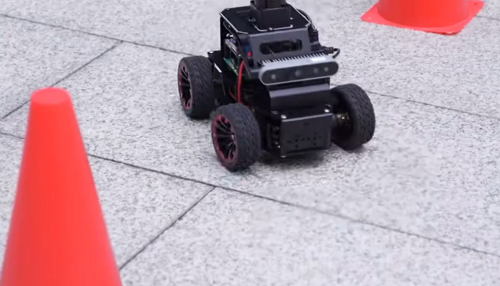
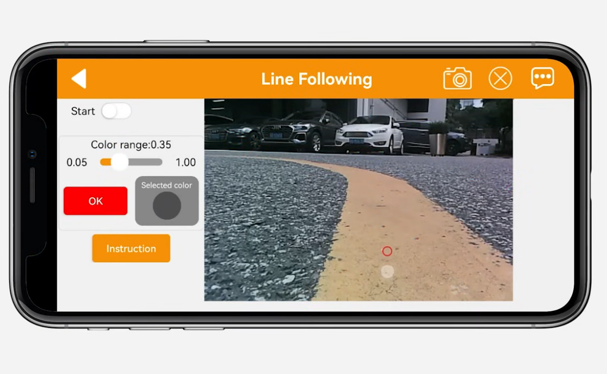
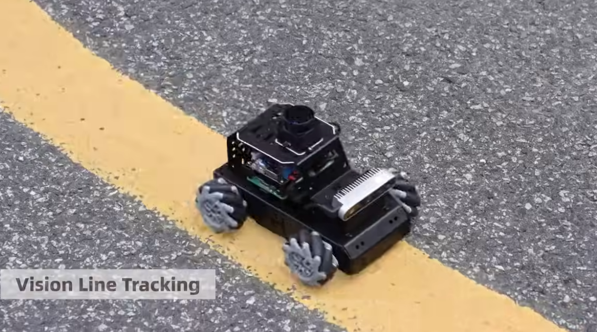
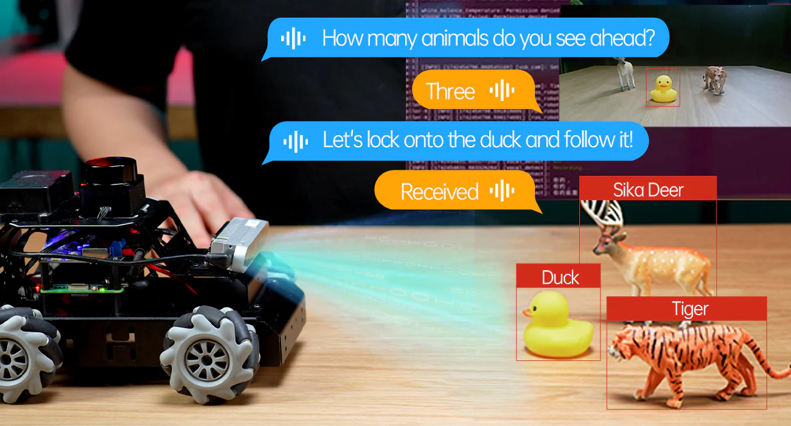

# MentorPi T1

[English](https://github.com/Hiwonder/MentorPi/blob/MentorPi-T1/README.md) | 中文

<p align="center">
  
</p>

## 产品介绍

我们创造MentorPi 的初衷很简单：随着AI技术的日益发展，我们希望可以打造一个高性价比的教育机器人平台，融合时下最流行的AI大模型技术和ROS2，让热爱AI的工程师、学生、开发者和创新者都能轻松学习先进的AI机器人技术，构建出更多有趣的AI创意项目。

MentorPi 拥有强大的硬件配置，它采用STM32控制器+树莓派5作为控制系统，并提供三种底盘可供选择——麦克纳姆轮、阿克曼转向和坦克履带，你可以根据自己的需要选择适合自己的底盘。

MentorPi 小巧的机身集成了高速编码器电机、激光雷达、3D 深度相机、AI语音模块等高性能硬件，能够实现复杂的 AI 行为，包括基于SLAM 的导航、实时物体追踪，甚至使用 YOLOv11进行交通路标识别，实现无人驾驶。

<p align="center">
  
</p>

<p align="center">
  
</p>

<p align="center">
  
</p>

<p align="center">
  
</p>

作为一个开源平台，MentorPi 鼓励定制和扩展。今年，我们不仅推出了多底盘支持，还部署了多模态AI大模型，支持自然语音交互，使机器人能够执行更复杂的具身智能任务。

无论您是构建自动驾驶项目，还是探索人机交互，都欢迎加入我们的社区，共同塑造 MentorPi 的未来。此外，您还可以查看 MentorPi 教程，快速入门！

<p align="center">
  
</p>

## 官方资源

### Hiwonder官方
- **官方网站**: [https://www.hiwonder.com/](https://www.hiwonder.com/)
- **产品页面**: [https://www.hiwonder.com/products/mentorpi-t1](https://www.hiwonder.com/products/mentorpi-t1)
- **官方文档**: [https://docs.hiwonder.com/projects/MentorPi/en/latest/](https://docs.hiwonder.com/projects/MentorPi/en/latest/)
- **技术支持**: support@hiwonder.com

## 主要功能

### AI视觉与导航
- **SLAM建图** - 实时同步定位与建图
- **路径规划** - 智能路线规划和导航
- **自动驾驶** - 具备避障功能的自动驾驶能力
- **YOLOv5识别** - 先进的路标和交通信号灯目标检测
- **视觉识别** - 先进的计算机视觉能力

### 智能控制
- **多模块底盘设计** - 支持麦克纳姆轮、阿克曼和履带三种配置
- **闭环电机控制** - 高精度编码器反馈控制
- **大扭矩舵机** - 重型操作的高功率舵机系统
- **多传感器融合** - 集成传感器数据处理

### 编程接口
- **ROS2集成** - 完整的机器人操作系统2支持
- **Python编程** - 全面的Python SDK
- **多模态AI模型** - 先进的具身AI能力
- **开源平台** - 完整的开源平台支持定制化

## 硬件配置
- **处理器**: 树莓派5
- **操作系统**: ROS2兼容Linux系统
- **电机**: 高速闭环编码器电机
- **视觉系统**: 3D深度相机 + 激光雷达传感器
- **执行器**: 大扭矩舵机
- **底盘**: 支持麦克纳姆轮、阿克曼和履带三种底盘配置

## 项目结构

```
mentorpi/
├── app/                    # 应用模块
├── bringup/               # 系统启动和配置
├── driver/                # 硬件驱动
├── example/               # 示例应用和演示
├── interfaces/            # ROS2消息定义
├── large_models/          # AI大模型集成
├── large_models_msgs/     # 大模型消息定义
├── peripherals/           # 外设支持
└── yolov5_ros2/          # YOLOv5 ROS2集成
```

## 版本信息
- **当前版本**: MentorPi T1 v1.0.0
- **支持平台**: 树莓派5

### 相关技术
- [ROS2](https://ros.org/) - 机器人操作系统2
- [OpenCV](https://opencv.org/) - 计算机视觉库
- [YOLOv5](https://github.com/ultralytics/yolov5) - 目标检测框架

---

**注**: 所有程序已预装在MentorPi T1机器人系统中，可直接运行。详细使用教程请参考[官方文档](https://docs.hiwonder.com/projects/MentorPi/en/latest/)。